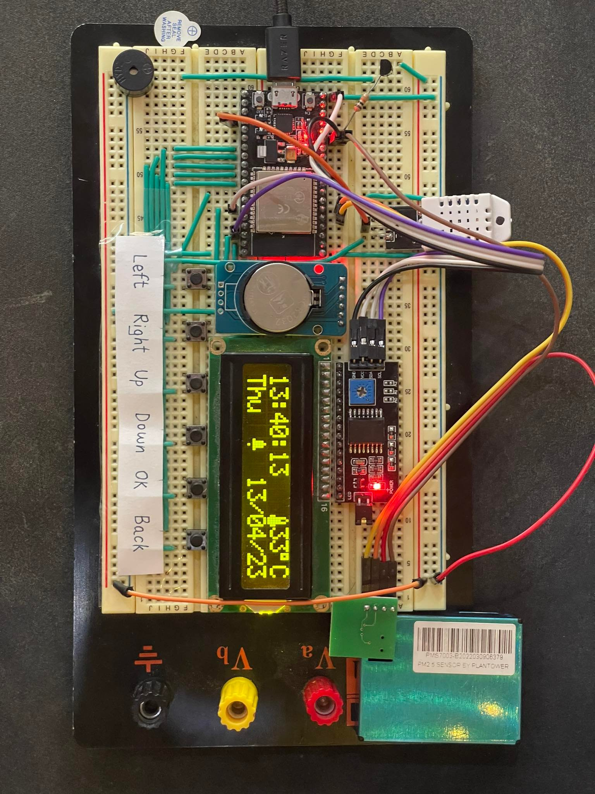

# Alarm Clock Project using ESP32

This project is part of the Embedded System Design Lab course of the Computer Engineering curriculum at King Mongkut's University of Technology North Bangkok ([KMUTNB](https://www.kmutnb.ac.th/)).

The Alarm Clock Project is an embedded system that utilizes ESP32S 38pins, and associated components, see below. We implements an alarm clock with additional features such as displaying the temperature, humidity, and dust levels in the room. It provides an easy-to-use interface for setting alarms, displaying the time, temperature, humidity, and air quality.

The system is designed to be modular and extensible, allowing for easy integration of additional sensors or features. The ESP32S microcontroller acts as the brain of the system and communicates with the various sensors and the LCD display to provide a complete alarm clock solution.

## Table of contents
* [Feature](#feature)
* [Components Used](#components-used)
* [Dependencies](#dependencies)
* [Troubleshooting](#troubleshooting)
* [Contributing](#contributing)
* [Credits](#credits)
* [License](#license)

## Feature
- [x] Displays the current time in 24-hour format
- [x] Displays the current date in dd/mm/yyyy format
- [x] Displays the abbreviated day of the week (e.g. Wed)
- [x] Displays humidity using DHT22
- [x] Displays temperature using DHT22
- [x] Displays PM1.0, PM2.5, and PM10 using PMS7003
- [x] Offers a menu-based navigation system.
- [x] Sounds an alarm when the set time is reached
- [x] Allows the user to save the alarm time information in the EEPROM.
- [ ] Offers a snooze function.
- [x] Sends environmental values to ThingSpeak using the MQTT protocol
- [x] Enables email notifications to be sent when environmental values reach their designated threshold.
- [x] Includes a keepalive mechanism to regularly check the availability of devices.

## Components Used
The following hardware components are used in this project:

* `ESP32S (38 pins) microcontroller`: The ESP32S is a powerful microcontroller based on the ESP32 chip, which is designed for Internet of Things (IoT) applications. It has 38 pins and is capable of running at up to 240 MHz. The ESP32S is the main brain of this project and is responsible for controlling all the other components.

* `DS3231 RTC module`: The DS3231 RTC module is a real-time clock module that is used to keep track of the time and date. It is highly accurate and can keep time even when the power is turned off. The module communicates with the ESP32S using the I2C protocol.

* `LCD 16x2 display`: The LCD 16x2 display is a character display that can display up to 16 characters per line and has 2 lines. It is used to display the time, date, temperature, humidity, and other information to the user. The display communicates with the ESP32S using the I2C protocol.

* `DHT22 temperature and humidity sensor`: The DHT22 sensor is a digital sensor that can measure both temperature and humidity. It has a range of -40 to 80 degrees Celsius for temperature and 0 to 100% for humidity. The sensor communicates with the ESP32S using a single-wire protocol.

* `PMS7003 dust (PM2.5) sensor`: The PMS7003 sensor is a digital sensor that can measure the concentration of PM2.5 particles in the air as well as PM1.0 and PM10. It uses a laser-based detection method and can provide accurate measurements in real-time. The sensor communicates with the ESP32S using a serial protocol (UART).

* `Active buzzer`: The active buzzer is an electronic component that can produce a sound when a voltage is applied to it. It is used in this project to produce an alarm sound when the set time is reached. The buzzer is connected to one of the digital pins of the ESP32S and is controlled using software.

## Dependencies
The software for this project was developed in Visual Studio Code with [PlatformIO](https://platformio.org/) extension using the ESP32 board package. The following libraries are used for connecting and communicating with the hardware components:

* `Wire.h`: This library provides a simple interface for communicating with I2C devices. In this project, it is used to communicate with the DS3231 RTC and the LCD display over the I2C bus.

* `DS3232RTC.h`: This library is specifically designed for communicating with the DS3231 RTC. It provides a set of functions that can be used to read and set the time and date, and other related parameters.

* `LiquidCrystal_I2C.h`: This library provides a simple interface for using I2C backpacks with character LCD displays. It allows the user to communicate with the LCD display over the I2C bus and set various display parameters such as cursor position, backlight brightness, and scrolling.

* `JC_Button.h`: This library is used for debouncing and handling button inputs. It provides a set of functions that can be used to detect button presses and releases, and handle them appropriately.

* `Adafruit_Sensor.h` and `DHT.h`: These libraries are used for reading the temperature and humidity from the DHT22 sensor. Adafruit_Sensor.h provides a common interface for working with different types of sensors, while DHT.h is specifically designed for working with DHT series of sensors.

* `SoftwareSerial.h`: This library allows the user to create a software-based serial port on any digital pin of the ESP32. In this project, it is used for serial communication with the PMS7003 sensor, which uses a serial protocol to transmit data.

## Troubleshooting
If the readings on the LCD screen are not accurate, check the connections of the sensors and ensure that the correct libraries have been installed. If the alarm does not sound, check the code to ensure that the alarm has been set correctly.

## Contributing
If you'd like to contribute to this project, please fork the repository and submit a pull request. We welcome contributions to improve the project and add new features.

## Credits
This project was created by [Vasapol Rittideah](https://www.github.com/VasapolRittideah) and [Natthaphat Suplaima](https://github.com/hill212063) for the Embedded System Design Lab course.

## License
This project is licensed under the [MIT License](https://opensource.org/license/mit/). See the `LICENSE` file for more information.
